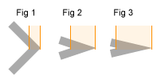

HTML canvas miterLimit 属性
===

## 示例

绘制最大斜接长度为 5 的线：

```html idoc:preview:iframe
<canvas id="myCanvas" width="300" height="150" style="border:1px solid #d3d3d3;"> 您的浏览器不支持 HTML5 canvas 标签。 </canvas>
<script>
var c = document.getElementById("myCanvas");
var ctx = c.getContext("2d");
ctx.lineWidth = 10;
ctx.lineJoin = "miter";
ctx.miterLimit = 5;
ctx.moveTo(20, 20);
ctx.lineTo(50, 27);
ctx.lineTo(20, 34);
ctx.stroke();
</script>
```

JavaScript:

```js
var c = document.getElementById("myCanvas");
var ctx = c.getContext("2d");
ctx.lineWidth = 10;
ctx.lineJoin = "miter";
ctx.miterLimit = 5;
ctx.moveTo(20, 20);
ctx.lineTo(50, 27);
ctx.lineTo(20, 34);
ctx.stroke();
```

## 浏览器支持

表中的数字指定了完全支持该属性的第一个浏览器版本。

| 属性 Property | ![chrome][1] | ![edge][2] | ![firefox][3] | ![safari][4] | ![opera][5] |
| ----------- | --- | --- | --- | --- | --- |
| miterLimit | Yes | 9.0 | Yes | Yes | Yes |
<!--rehype:style=width: 100%; display: inline-table;-->

## 定义和用法

`miterLimit` 属性设置或返回最大斜接长度。

斜接长度是两条线相交处的内角和外角之间的距离。



**提示：** miterLimit 属性仅在 lineJoin 属性为“miter”时有效。

随着角的角度变小，斜接长度变大。

为了防止斜接长度*太*长，我们可以使用 miterLimit 属性。

如果斜接长度超过 miterLimit 值，角将显示为 lineJoin type "bevel"（Fig 3）：


| 默认值: | `10` |
| -------- | -------- |
| JavaScript 语法: | *context*.miterLimit=*number*; |
<!--rehype:style=width: 100%; display: inline-table;-->

## 属性值

| 值  | 描述 Description |
| ------ | ------ |
| *number* | 一个正数，指定最大斜接长度。 如果当前斜接长度超过 miterLimit，角将显示为 lineJoin "bevel" |
<!--rehype:style=width: 100%; display: inline-table;-->

[1]: ../assets/chrome.svg
[2]: ../assets/edge.svg
[3]: ../assets/firefox.svg
[4]: ../assets/safari.svg
[5]: ../assets/opera.svg

