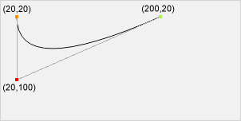

HTML canvas quadraticCurveTo() 方法
===

## 示例

绘制二次贝塞尔曲线：

```html idoc:preview:iframe
<canvas id="myCanvas" width="300" height="150" style="border:1px solid #d3d3d3;">您的浏览器不支持 HTML5 canvas 标签。</canvas>
<script>
  var c = document.getElementById("myCanvas");
  var ctx = c.getContext("2d");
  ctx.beginPath();
  ctx.moveTo(20, 20);
  ctx.quadraticCurveTo(20, 100, 200, 20);
  ctx.stroke();
</script> 
```

JavaScript:

```js
var c = document.getElementById("myCanvas");
var ctx = c.getContext("2d");
ctx.beginPath();
ctx.moveTo(20, 20);
ctx.quadraticCurveTo(20, 100, 200, 20);
ctx.stroke();
```

## 浏览器支持

表中的数字指定了完全支持该属性的第一个浏览器版本。

| 方法 Method | ![chrome][1] | ![edge][2] | ![firefox][3] | ![safari][4] | ![opera][5] |
| ------- | --- | --- | --- | --- | --- |
| `quadraticCurveTo()` | Yes | 9.0 | Yes | Yes | Yes |
<!--rehype:style=width: 100%; display: inline-table;-->

## 定义和用法

`quadraticCurveTo()` 方法通过使用表示二次贝塞尔曲线的指定控制点向当前路径添加一个点。

二次贝塞尔曲线需要两个点。 第一个点是二次贝塞尔计算中使用的控制点，第二个点是曲线的终点。 曲线的起点是当前路径中的最后一个点。 如果路径不存在，则使用 [beginPath()](canvas_beginpath.md) 和 [moveTo()](canvas_moveto.md) 方法定义起点。




起点：

```js
moveTo(20, 20)
```

控制点：

```js
quadraticCurveTo(20,100,200,20)
```

终点：

```js
quadraticCurveTo(20,100,200,20)
```

**提示：** 查看 [bezierCurveTo()](canvas_beziercurveto.md) 方法。 它有两个控制点而不是一个。

| JavaScript 语法: | *context*.quadraticCurveTo(*cpx,cpy,x,y*); |
| ----- | ----- |
<!--rehype:style=width: 100%; display: inline-table;-->

## 参数值

| 参数 | 描述 Description |
| ----- | ----- |
| *cpx*     | 贝塞尔控制点的 x 坐标 |
| *cpy*     | 贝塞尔控制点的 y 坐标 |
| *x*       | 结束点的 x 坐标 |
| *y*       | 结束点的 y 坐标 |
<!--rehype:style=width: 100%; display: inline-table;-->


[1]: ../assets/chrome.svg
[2]: ../assets/edge.svg
[3]: ../assets/firefox.svg
[4]: ../assets/safari.svg
[5]: ../assets/opera.svg