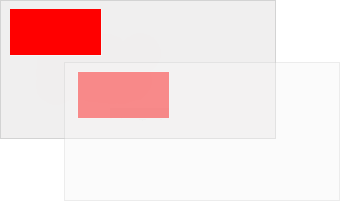

HTML canvas translate() 方法
===

## 示例

在位置 (10,10) 绘制一个矩形，将新的 (0,0) 位置设置为 (70,70)。 再次绘制相同的矩形（注意矩形现在从位置 (80,80) 开始：

```html idoc:preview:iframe
<canvas id="myCanvas" width="300" height="150" style="border:1px solid #d3d3d3;">您的浏览器不支持 HTML5 canvas 标签。</canvas>

<script>
var c = document.getElementById("myCanvas");
var ctx = c.getContext("2d");
ctx.fillRect(10, 10, 100, 50);
ctx.translate(70, 70);
ctx.fillRect(10, 10, 100, 50);
</script>
```

JavaScript:

```js
var c = document.getElementById("myCanvas");
var ctx = c.getContext("2d");
ctx.fillRect(10, 10, 100, 50);
ctx.translate(70, 70);
ctx.fillRect(10, 10, 100, 50);
```

## 浏览器支持

表中的数字指定了完全支持该属性的第一个浏览器版本。

| 方法 Method | ![chrome][1] | ![edge][2] | ![firefox][3] | ![safari][4] | ![opera][5] |
| ------- | --- | --- | --- | --- | --- |
| translate() | Yes | 9.0 | Yes | Yes | Yes |
<!--rehype:style=width: 100%; display: inline-table;-->

## 定义和用法

`translate()` 方法重新映射画布上的 `(0,0)` 位置。

**注意：** 在 `translate()` 之后调用诸如 [`fillRect()`](./canvas_fillrect.md) 之类的方法时，会将值添加到 x 和 y 坐标值中。



| JavaScript 语法: | *context*.translate(*x,y*); |
| ----- | ----- |
<!--rehype:style=width: 100%; display: inline-table;-->

## 参数值

**注意：** 您可以指定一个或两个参数。

| 参数 | 描述 Description |
| ----- | ----- |
| *x*       | 添加到水平 (x) 坐标的值 | 
| *y*       | 添加到垂直 (y) 坐标的值 | 
<!--rehype:style=width: 100%; display: inline-table;-->


[1]: ../assets/chrome.svg
[2]: ../assets/edge.svg
[3]: ../assets/firefox.svg
[4]: ../assets/safari.svg
[5]: ../assets/opera.svg
