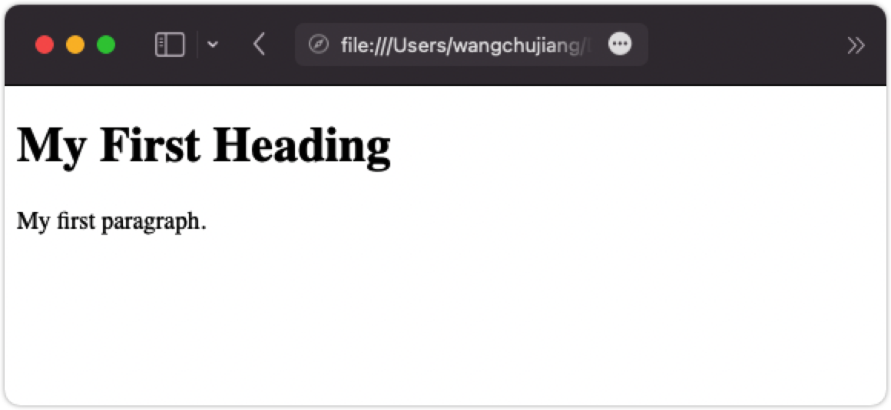

HTML \<figcaption> 标签
===

## 示例

使用 [\<figure>](./figure.md) 元素标记文档中的照片，并使用 \<figcaption> 元素定义照片的标题：

```html idoc:preview:iframe
<figure>
  
  <figcaption>图.1 - 第一个HTML页面</figcaption>
</figure>
```
<!--rehype:style=min-height: 200px;-->

## 定义和用法

`<figcaption>` 标签定义了 [\<figure>](./figure.md) 元素的标题。

`<figcaption>` 元素可以作为 [\<figure>](./figure.md) 元素的第一个或最后一个子元素放置。

## 浏览器支持

表中的数字指定了完全支持该元素的第一个浏览器版本。

| Element | ![chrome][1] | ![edge][2] | ![firefox][3] | ![safari][4] | ![opera][5] |
| ----- | --- | --- | --- | --- | --- |
| \<figcaption> | 8.0 | 9.0 | 4.0 | 5.1 | 11.0 |

## 全局属性

`<figcaption>` 标签支持 HTML 中的[全局属性](../reference/standardattributes.md)。

## 事件属性

`<figcaption>` 标签支持 HTML 中的[事件属性](../reference/eventattributes.md)。

## 更多示例

使用 CSS 设置 \<figure> 和 \<figcaption> 的样式：

```html idoc:preview:iframe
<html>
<head>
  <style>
    figure {
      border: 1px #cccccc solid;
      padding: 4px;
      margin: auto;
    }
    figcaption {
      background-color: black;
      color: white;
      font-style: italic;
      padding: 2px;
      text-align: center;
    }
  </style>
</head>
<body>
  <figure>
    
    <figcaption>图.1 - 第一个HTML页面</figcaption>
  </figure>
</body>
</html>
```

## 默认 CSS 设置

大多数浏览器将显示具有以下默认值的 `<figcaption>` 元素：

```css
figcaption {
  display: block;
}
```

[1]: ../assets/chrome.svg
[2]: ../assets/edge.svg
[3]: ../assets/firefox.svg
[4]: ../assets/safari.svg
[5]: ../assets/opera.svg