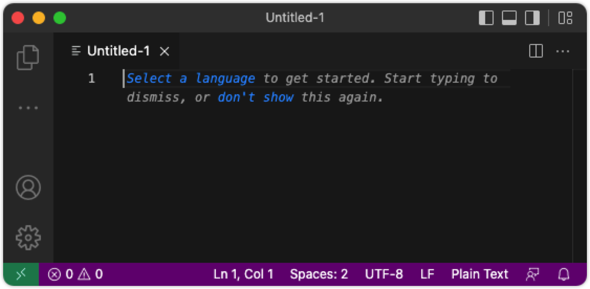
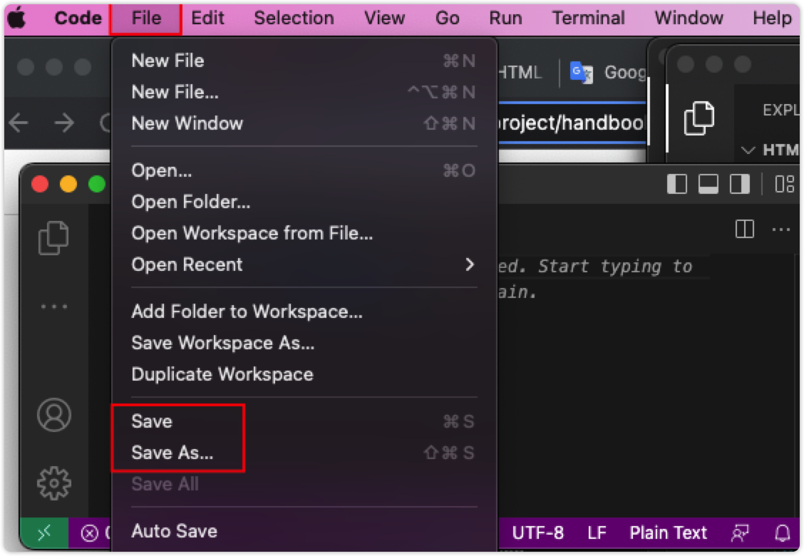

HTML \ loading 属性
===

## 示例

向首屏下方的图像添加延迟加载：

```html idoc:preview
<!-- 屏幕外图像 -->



```
<!--rehype:style=min-height: 300px;-->


## 定义和用法

`loading` 属性指定浏览器是应该立即加载图像还是推迟加载屏幕外图像，例如，直到用户滚动到它们附近。

**提示：** 仅将 `loading="lazy"` 添加到位于首屏下方的图像。

## 浏览器支持

| 属性 Attribute | ![chrome][1] | ![edge][2] | ![firefox][3] | ![safari][4] | ![opera][5] |
| ------- | --- | --- | --- | --- | --- |
| loading   | 77.0 | 79.0 | 75.0 | Not Supported | 64.0 |
<!--rehype:style=width: 100%; display: inline-table;-->

## 语法

```html

```

## 属性值

| 值 Value | 描述 Description |
| ----- | ----- |
| eager | 默认。 立即加载图像 |
| lazy  | 延迟加载图像，直到满足某些条件 |
<!--rehype:style=width: 100%; display: inline-table;-->


[1]: ../assets/chrome.svg
[2]: ../assets/edge.svg
[3]: ../assets/firefox.svg
[4]: ../assets/safari.svg
[5]: ../assets/opera.svg