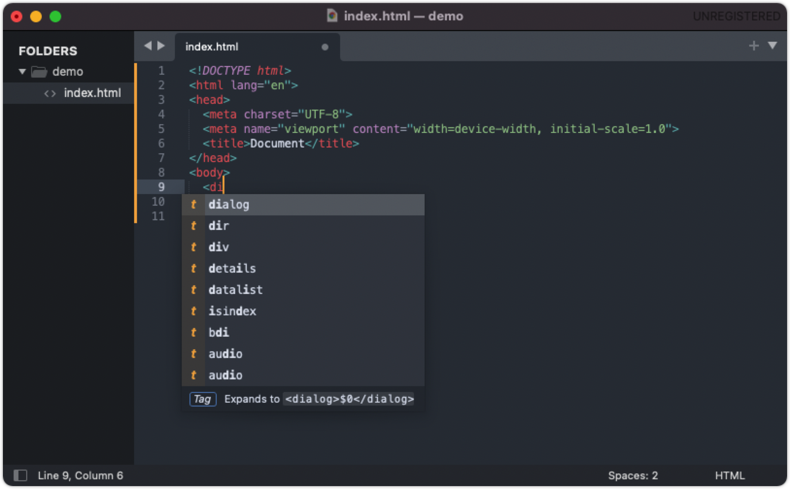
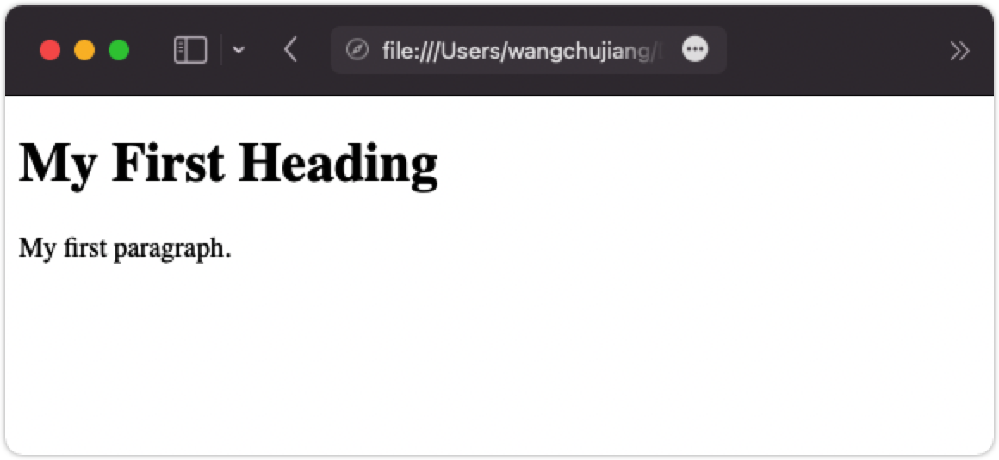

HTML 编辑器 Editors
===

一个简单的文本编辑器就是您学习 HTML 所需要的一切。

## 使用 Visual Studio Code 学习 HTML

可以使用专业的 HTML 编辑器创建和修改网页。

但是，对于学习 HTML，我们可以使用简单的文本编辑器，如 Notepad (PC) 或 TextEdit (Mac)。

我们有更好的编辑器推荐，如 [Sublime Text](https://www.sublimetext.com/) 或 [Visual Studio Code](https://code.visualstudio.com/) 它们有良好的代码提示代码高亮，丰富的插件，同时它们还跨平台。

### Sublime Text

[](https://www.sublimetext.com/)

> Sublime Text 下载安装地址：https://www.sublimetext.com

### Visual Studio Code

[](https://code.visualstudio.com/)

> VSCode 下载安装地址：https://code.visualstudio.com

按照以下步骤使用 [Visual Studio Code](https://code.visualstudio.com/) 创建您的第一个网页。


## 第一步： 启动 VSCode

Mac 平台：

打开 `访达` > `应用程序` > `Visual Studio Code.app`


打开编辑器之后我们只需使用快捷 <kbd>command</kbd> + <kbd>n</kbd> 键创建一个新文档即可。


## 第二步： 写一些 HTML

```html
<!DOCTYPE html>
<html>
<body>
  <h1>My First Heading</h1>
  <p>My first paragraph.</p>
</body>
</html>
```


## 第三步： 保存 HTML 页面

然后在 `菜单` 选择 `File` > `Save` 保存为 `demo.html`，注意请添加上文件后缀 `.html`


## 第四步： 在浏览器中查看 HTML 页面

在您喜欢的浏览器中打开保存的 HTML 文件（双击文件，或右键单击 - 并选择 `打开方式`）。

结果将如下所示：


