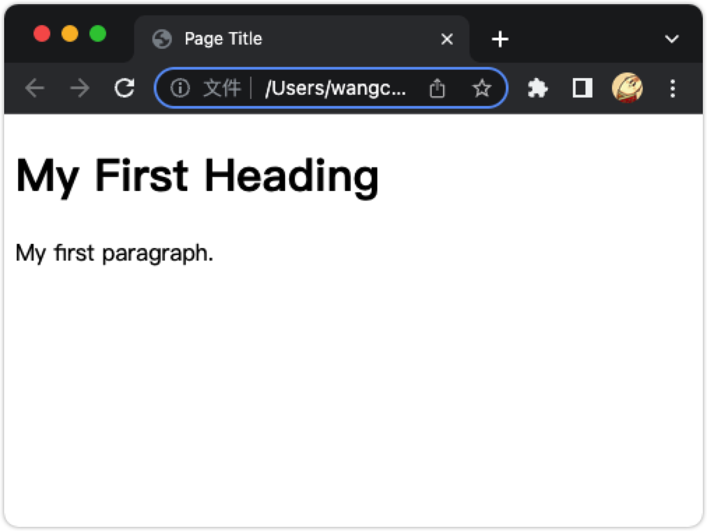

HTML 简介 Introduction
===

HTML 是用于创建网页的标准标记语言。

## 什么是 HTML？

* HTML 代表超文本标记语言
* HTML 是创建网页的标准标记语言
* HTML 描述网页的结构
* HTML 由一系列 _元素_ 组成
* HTML 元素告诉浏览器如何显示内容
* HTML 元素标记内容片段，例如 `这是一个标题`、`这是一个段落`、`这是一个链接`等。

## 一个简单的 HTML 文档

```html idoc:preview:iframe
<!DOCTYPE html>
<html>
<head>
  <title>Page Title</title>
</head>
<body>
  <h1>My First Heading</h1>
  <p>My first paragraph.</p>
</body>
</html>
```

**示例解释**

* `<!DOCTYPE html>` 声明定义此文档是 HTML5 文档
* `<html>` 元素是 HTML 页面的**根元素**
* `<head>` 元素包含有关 HTML 页面的元信息
* `<title>` 元素指定 HTML 页面的**标题**（显示在浏览器的标题栏或页面的选项卡中）
* `<body>` 元素定义了文档的 **正文**，是所有可见内容的容器，例如标题、段落、图像、超链接、表格、列表等。
* `<h1>` 元素定义了一个 **大标题**
* `<p>` 元素定义了一个 **段落**

## 什么是 HTML 元素？

HTML 元素由开始标签、一些内容和结束标签定义

```html
<tagname> 内容在这里... </tagname>
```

```bash
                    ╭┈┈┈┈┈┈┈┈┈┈┈╮
                    ┆  Element  ┆
                    ╰┈┈┈┈┈┬┈┈┈┈┈╯
                          ▼ 
     ╭┈┈┈┈┈┈┈┈┈┈┈┈┈┈┈┈┈┈┈┈┴┈┈┈┈┈┈┈┈┈┈┈┈┈┈┈┈┈┈┈┈┈╮
  开始标签              文本内容               结束标签
     ▼               ╰┈┈┈┈┬┈┈┈┈╯               ▼
╭┈┈┈┈┴┈┈┈┈┈┈┈┈┈┈┈┈┈┈┈┈┈┈┈┈┴┈┈┈┈┈┈┈┈┈┈┈┈┈┈┈┈┈┈┈┈┴┈┈┈┈╮
┆ <div class="ab">   this my content        </div>  ┆
╰┈┈┈┈┈┈╱┈┈┈┈┈┈┈┈╲┈┈┈┈┈┈┈┈┈┈┈┈┈┈┈┈┈┈┈┈┈┈┈┈┈┈┈┈┈┈┈┈┈┈┈╯
   属性名称      属性值
    name        value
     ╰┈┈┈┈┈┈┬┈┈┈┈┈╯
     Attribute(属性)
```

HTML **element** 是从开始标记到结束标记的所有内容：

```html
<h1>我的第一个标题</h1>
<p>我的第一个段落。</p>
```

| 开始标签 Start tag | 元素内容 Element content | 结束标签 End tag |
| --------- | ------------------- | ------- |
| \<h1> | 我的第一个标题    | \</h1>  |
| \<p>  | 我的第一个段落。  | \</p> |
| \<br> | *none* | *none*  |

**注意：** 一些 HTML 元素没有内容（如 \<br> 元素）。 这些元素称为空元素。 空元素没有结束标签！

## 网络浏览器

Web 浏览器（[Chrome](https://www.google.cn/chrome/index.html)、[Edge](https://www.microsoft.com/zh-cn/edge)、[Firefox](http://www.firefox.com.cn/)、[Safari](https://www.apple.com/safari/)）的目的是读取 HTML 文档并正确显示它们。

浏览器不显示 HTML 标记，而是使用它们来确定如何显示文档：


<!--rehype:style=max-width: 520px;-->

## HTML页面结构

下面是一个 HTML 页面结构的可视化：

```html idoc:preview
<div style="padding: 12px; border: 1px solid var(--color-border-default); background: var(--color-canvas-subtle);">
&lt;html&gt;
  <div style="margin: 15px;padding: 6px; border: 1px solid var(--color-border-default);">
    &lt;head&gt;
    <div style="margin: 10px;padding: 6px;  border: 1px solid var(--color-border-default);">
      &lt;title&gt;Page title&lt;/title&gt;
    </div>
    &lt;/head&gt;
  </div>
  <div style="margin: 15px;padding: 6px; border: 1px solid var(--color-border-default);">
    &lt;body&gt;
    <div style="margin: 5px;padding: 6px; border: 1px solid var(--color-border-default);background: var(--color-accent-fg);">
      <div style="margin: 10px;padding: 6px;  border: 1px solid var(--color-border-default);">
        &lt;h1&gt;This is a heading&lt;/h1&gt;
      </div>
      <div style="margin: 10px;padding: 6px;  border: 1px solid var(--color-border-default);">
        &lt;p&gt;This is a paragraph.&lt;/p&gt;
      </div>
      <div style="margin: 10px;padding: 6px;  border: 1px solid var(--color-border-default);">
        &lt;p&gt;This is another paragraph.&lt;/p&gt;
      </div>
    </div>
    &lt;/body&gt;
  </div>
  &lt;/html&gt;
</div>
```

**注意：** **\<body>** 部分（上面的 **蓝色**<!--rehype:style=color: blue;--> 区域）内的内容将显示在浏览器中。 **\<title>** 元素内的内容将显示在浏览器的标题栏或页面的选项卡中。

## HTML 历史

自万维网诞生之初，就出现了许多 HTML 版本：

| Year | Version |
| ---- | ---- |
| 1989 | Tim Berners-Lee 发明了 www                                            |
| 1991 | Tim Berners-Lee 发明了 HTML                                           |
| 1993 | Dave Raggett 起草了 HTML+                                              |
| 1995 | HTML 工作组定义的 HTML 2.0                                     |
| 1997 | W3C Recommendation: HTML 3.2                                            |
| 1999 | W3C Recommendation: HTML 4.01                                           |
| 2000 | W3C Recommendation: XHTML 1.0                                           |
| 2008 | WHATWG HTML5 首次公开草案                                         |
| 2012 | [WHATWG HTML5 Living Standard](http://whatwg.org/html/)                 |
| 2014 | [W3C Recommendation: HTML5](http://www.w3.org/TR/html5/)                |
| 2016 | W3C Candidate Recommendation: HTML 5.1                                  |
| 2017 | [W3C Recommendation: HTML5.1 2nd Edition](http://www.w3.org/TR/html51/) |
| 2017 | [W3C Recommendation: HTML5.2](http://www.w3.org/TR/html52/)             |

本教程遵循最新的 HTML5 标准。
